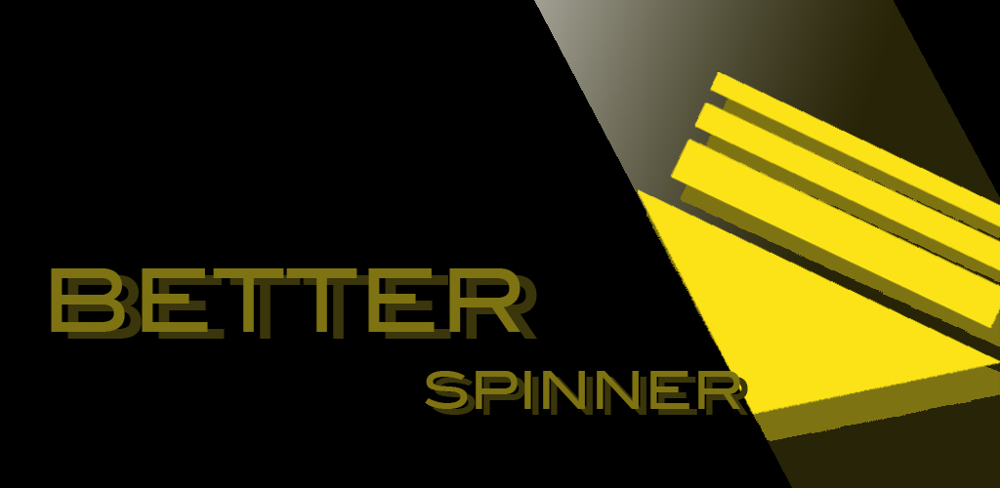
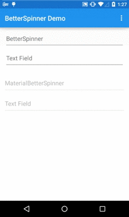

# BetterSpinner

[](http://android-arsenal.com/details/1/1707)

If you like developing Android, you must "hate" Spinners. I had countless issues with Spinners and I decided to make a new one. BetterSpinner is using AutoCompleteTextView to do what a Spinner really should do.

## Screenshots


## Examples
The demo is a showcase of the functionality of the library.

[](https://play.google.com/store/apps/details?id=com.weiwangcn.betterspinner.sample)

Or
 
Download the APK file here: [BetterSpinner.Demo-1.1.0.apk](https://github.com/Lesilva/BetterSpinner/releases/download/1.1.0/BetterSpinner.Demo-1.1.0.apk)

## Usage
BetterSpinner can be used just like [AutoCompleteTextView](http://developer.android.com/reference/android/widget/AutoCompleteTextView.html).

```java
ArrayAdapter<String> adapter = new ArrayAdapter<String>(this,
                 android.R.layout.simple_dropdown_item_1line, COUNTRIES);
         BetterSpinner textView = (BetterSpinner)
                 findViewById(R.id.countries_list);
         textView.setAdapter(adapter);
     }

     private static final String[] COUNTRIES = new String[] {
         "Belgium", "France", "Italy", "Germany", "Spain"
     };
```

or you can also store you arrays in arrays.xml and do something like this in your code

```java
String[] COUNTRIES = getResources().getStringArray(R.array.countries_list);
```

For usage of MaterialEditText 2.0.3, check it out [here](https://github.com/rengwuxian/MaterialEditText/wiki)

If you want to use material style AutoCompleteTextView, simply replace BetterSpinner with MaterialBetterSpinner.

## Download
BetterSpinner is now pushed to Maven Central as an AAR, so you just need to add the following dependency to your `build.gradle`.
gradle:

For normal look use (BetterSpinner):

```groovy
compile 'com.weiwangcn.betterspinner:library:1.1.0'
```

If you have appcompat-v7 in your dependencies make sure to exclude it :

```groovy
compile ('com.weiwangcn.betterspinner:library:1.1.0') {
    exclude group: 'com.android.support', module: 'appcompat-v7'
}
```

For material look use (MaterrialBetterSpinner):

```groovy
compile 'com.weiwangcn.betterspinner:library-material:1.1.0'
```

If you have appcompat-v7 and MaterialEditText in your dependencies make sure to exclude them :

```groovy
compile ('com.weiwangcn.betterspinner:library-material:1.1.0') {
    exclude group: 'com.android.support', module: 'appcompat-v7'
    exclude group: 'com.rengwuxian.materialedittext', module: 'library'
}
```

Note: library-material has included [MaterialEditText 2.0.3](https://github.com/rengwuxian/MaterialEditText).


## Acknowledgements
Thanks my girlfriend Wanrong(wt263@msstate.edu) for the app icon :)

Thanks [Matt](https://github.com/mattblang) for his inspiration

[MaterialEditText](https://github.com/rengwuxian/MaterialEditText)


## License

    Copyright 2015 Wei Wang

    Licensed under the Apache License, Version 2.0 (the "License");
    you may not use this file except in compliance with the License.
    You may obtain a copy of the License at

       http://www.apache.org/licenses/LICENSE-2.0

    Unless required by applicable law or agreed to in writing, software
    distributed under the License is distributed on an "AS IS" BASIS,
    WITHOUT WARRANTIES OR CONDITIONS OF ANY KIND, either express or implied.
    See the License for the specific language governing permissions and
    limitations under the License.
